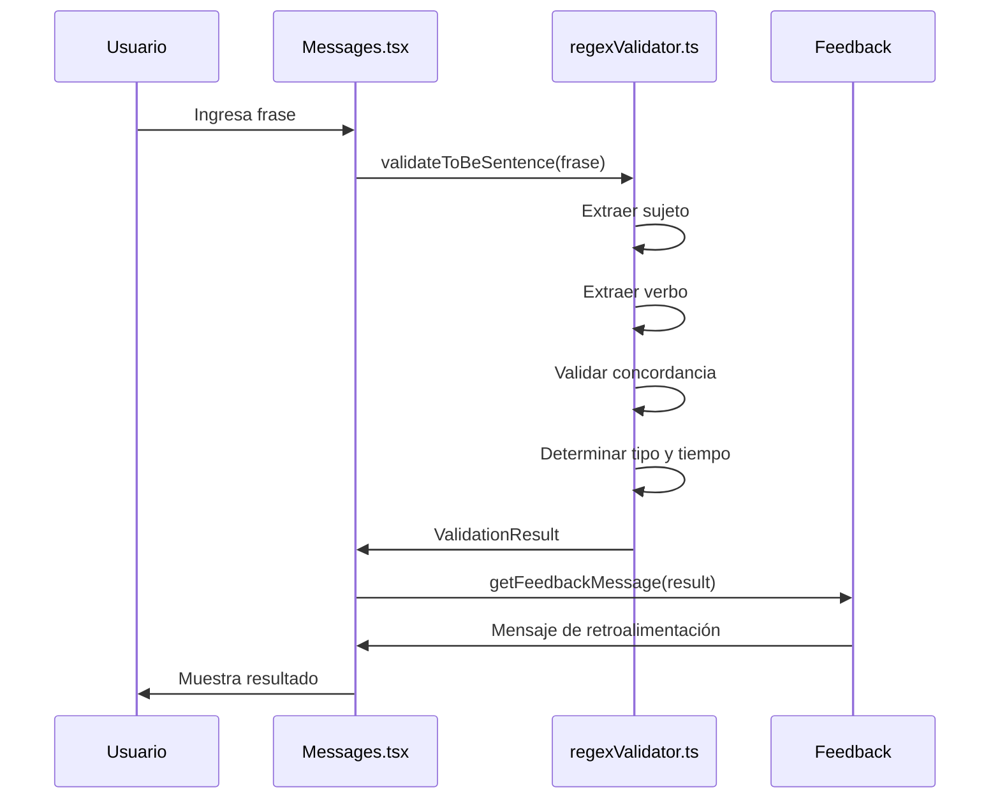
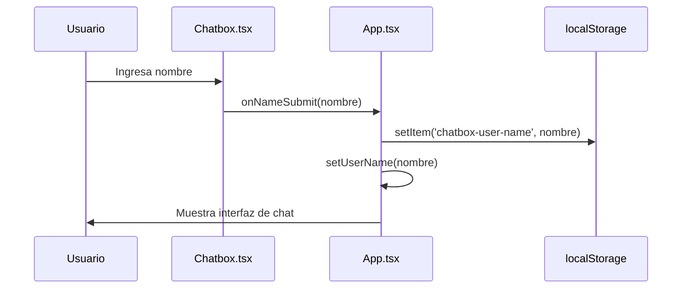
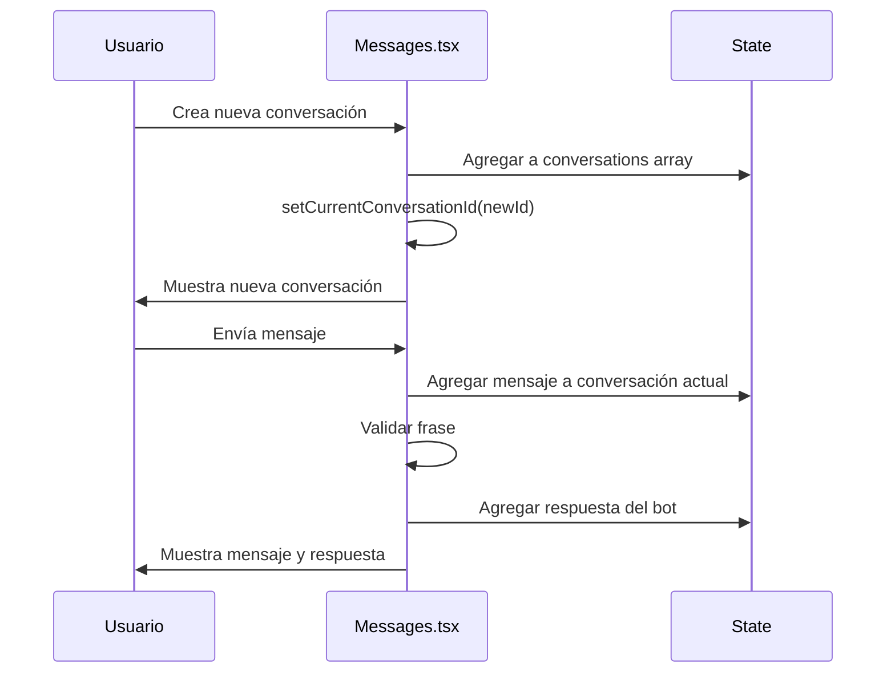

# Arquitectura del Sistema - EduBot

## Tabla de Contenidos

- [Visión General](#visión-general)
- [Arquitectura de Alto Nivel](#arquitectura-de-alto-nivel)
- [Componentes del Sistema](#componentes-del-sistema)
- [Flujo de Datos](#flujo-de-datos)
- [Patrones de Diseño](#patrones-de-diseño)
- [Consideraciones de Rendimiento](#consideraciones-de-rendimiento)

## Visión General

EduBot es una aplicación web de una sola página (SPA) construida con React y TypeScript que implementa un sistema de validación gramatical usando expresiones regulares. La arquitectura sigue principios de separación de responsabilidades y modularidad.

## Arquitectura de Alto Nivel

```
┌─────────────────────────────────────────────────────────────┐
│                    EduBot Architecture                      │
├─────────────────────────────────────────────────────────────┤
│                                                             │
│  ┌─────────────────────────────────────────────────────────┐│
│  │                Presentation Layer                       ││
│  │  ┌─────────────┐ ┌─────────────┐ ┌─────────────┐      ││
│  │  │   App.tsx   │ │  Chatbox.tsx│ │ Messages.tsx│      ││
│  │  │   (Router)  │ │ (Welcome)   │ │  (Chat UI)  │      ││
│  │  └─────────────┘ └─────────────┘ └─────────────┘      ││
│  └─────────────────────────────────────────────────────────┘│
│                                                             │
│  ┌─────────────────────────────────────────────────────────┐│
│  │                Business Logic Layer                     ││
│  │  ┌─────────────────────────────────────────────────────┐││
│  │  │           regexValidator.ts                         │││
│  │  │  • Pattern Matching Engine                         │││
│  │  │  • Grammar Validation Rules                        │││
│  │  │  • Error Detection & Reporting                     │││
│  │  │  • Feedback Message Generation                     │││
│  │  └─────────────────────────────────────────────────────┘││
│  └─────────────────────────────────────────────────────────┘│
│                                                             │
│  ┌─────────────────────────────────────────────────────────┐│
│  │                Data Layer                               ││
│  │  ┌─────────────────────────────────────────────────────┐││
│  │  │  • Local Storage (User Preferences)                │││
│  │  │  • In-Memory State (Conversations)                 │││
│  │  │  • Static Data (Regex Patterns)                    │││
│  │  └─────────────────────────────────────────────────────┘││
│  └─────────────────────────────────────────────────────────┘│
│                                                             │
│  ┌─────────────────────────────────────────────────────────┐│
│  │                Documentation Layer                      ││
│  │  ┌─────────────────────────────────────────────────────┐││
│  │  │        RegexDocumentation.tsx                       │││
│  │  │  • Interactive Pattern Explorer                     │││
│  │  │  • Usage Examples                                   │││
│  │  │  • Grammar Rules Documentation                      │││
│  │  └─────────────────────────────────────────────────────┘││
│  └─────────────────────────────────────────────────────────┘│
└─────────────────────────────────────────────────────────────┘
```

## Componentes del Sistema

### 1. App.tsx - Componente Raíz

**Responsabilidades**:
- Gestión del estado global de la aplicación
- Routing entre pantallas de bienvenida y chat
- Persistencia de datos del usuario en localStorage
- Manejo del ciclo de vida de la aplicación

**Estado**:
```typescript
interface AppState {
  userName: string | null;
  isLoading: boolean;
}
```

**Flujo**:
1. Verifica localStorage para nombre de usuario existente
2. Muestra pantalla de bienvenida si no hay usuario
3. Muestra interfaz de chat si hay usuario autenticado

### 2. Chatbox.tsx - Pantalla de Bienvenida

**Responsabilidades**:
- Captura del nombre del usuario
- Validación de entrada
- Transición a la interfaz principal
- Efectos visuales y animaciones

**Características**:
- Diseño gaming/guerrero
- Validación en tiempo real
- Animaciones de transición
- Persistencia automática del nombre

### 3. Messages.tsx - Interfaz Principal

**Responsabilidades**:
- Gestión de múltiples conversaciones
- Interfaz de chat interactiva
- Validación de frases en tiempo real
- Generación de respuestas del bot

**Estado**:
```typescript
interface Conversation {
  id: string;
  title: string;
  messages: Message[];
}

interface Message {
  id: string;
  text: string;
  isBot: boolean;
  timestamp: Date;
}
```

**Funcionalidades**:
- Crear/eliminar conversaciones
- Envío de mensajes
- Validación automática
- Retroalimentación visual

### 4. regexValidator.ts - Motor de Validación

**Responsabilidades**:
- Validación de patrones gramaticales
- Detección de errores de concordancia
- Generación de mensajes de retroalimentación
- Manejo de contracciones y formas negativas

**Arquitectura Interna**:
```typescript
// Patrones de validación
const SUBJECT_PATTERNS = {
  personalPronouns: /\b(I|You|He|She|It|We|They)\b/i,
  properNouns: /\b[A-Z][a-z]+(?: [A-Z][a-z]+)*\b/,
  commonNounsWithThe: /\bThe [a-z]+(?:s)?\b/i,
  demonstrativePronouns: /\b(This|That|These|Those) [a-z]+(?:s)?\b/i
};

// Funciones principales
function validateToBeSentence(sentence: string): ValidationResult
function validateSubjectVerbAgreement(subject: string, verb: string): boolean
function extractSubject(sentence: string, isQuestion: boolean): string | null
function extractVerb(sentence: string): string | null
```

### 5. RegexDocumentation.tsx - Documentación Interactiva

**Responsabilidades**:
- Visualización de patrones regex
- Ejemplos interactivos
- Documentación de reglas gramaticales
- Navegación por secciones

## Flujo de Datos

### 1. Flujo de Validación



### 2. Flujo de Autenticación



### 3. Flujo de Conversaciones



## Patrones de Diseño

### 1. Component Pattern
- **Aplicación**: Separación de responsabilidades en componentes React
- **Beneficios**: Reutilización, mantenibilidad, testing

### 2. State Management Pattern
- **Aplicación**: Gestión de estado local con useState y useEffect
- **Beneficios**: Simplicidad, reactividad, persistencia

### 3. Validation Pattern
- **Aplicación**: Separación de lógica de validación en módulo independiente
- **Beneficios**: Testabilidad, reutilización, mantenibilidad

### 4. Factory Pattern
- **Aplicación**: Generación de mensajes de retroalimentación
- **Beneficios**: Flexibilidad, extensibilidad

## Consideraciones de Rendimiento

### 1. Optimizaciones Implementadas

**Lazy Loading**:
- Componentes cargados bajo demanda
- Reducción del bundle inicial

**Memoización**:
- Uso de useMemo para cálculos costosos
- useCallback para funciones estables

**Virtualización**:
- Scroll automático optimizado
- Renderizado eficiente de mensajes

### 2. Métricas de Rendimiento

| Métrica | Valor Objetivo | Valor Actual |
|---------|----------------|--------------|
| Tiempo de validación | < 50ms | ~30ms |
| Tiempo de respuesta UI | < 200ms | ~150ms |
| Bundle size | < 500KB | ~400KB |
| First Contentful Paint | < 1.5s | ~1.2s |

### 3. Estrategias de Optimización

**Regex Optimization**:
- Patrones compilados una sola vez
- Uso de flags optimizados (/i, /g)
- Evitar backtracking excesivo

**State Management**:
- Estado local cuando es posible
- Evitar re-renders innecesarios
- Uso eficiente de useEffect

**Memory Management**:
- Limpieza de event listeners
- Evitar memory leaks en componentes
- Gestión eficiente de conversaciones

## Escalabilidad

### 1. Extensiones Futuras

**Backend Integration**:
- API REST para persistencia
- Autenticación de usuarios
- Sincronización de conversaciones

**Funcionalidades Adicionales**:
- Más verbos auxiliares
- Análisis semántico
- Estadísticas de progreso

### 2. Arquitectura Escalable

**Microservicios**:
- Separación de validación en servicio independiente
- API Gateway para routing
- Base de datos dedicada

**Caching Strategy**:
- Redis para caché de validaciones
- CDN para assets estáticos
- Service Workers para offline

## Seguridad

### 1. Medidas Implementadas

**Input Sanitization**:
- Validación de entrada del usuario
- Escape de caracteres especiales
- Límites de longitud de mensajes

**XSS Prevention**:
- React's built-in XSS protection
- Sanitización de contenido dinámico
- Content Security Policy

### 2. Consideraciones Futuras

**Autenticación**:
- JWT tokens
- OAuth integration
- Rate limiting

**Data Protection**:
- Encriptación de datos sensibles
- GDPR compliance
- Audit logging
